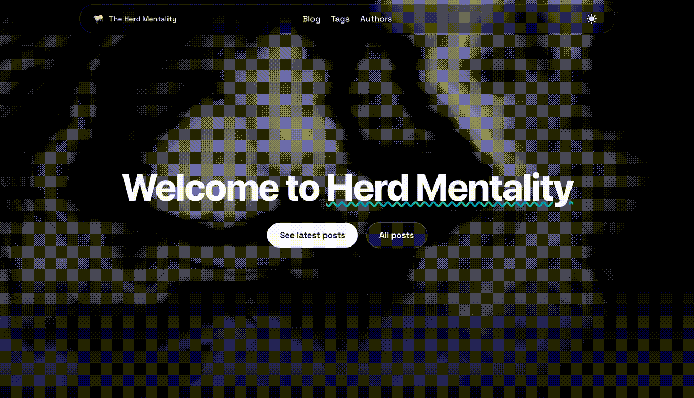

# 🐏 The Herd Mentality Blog

Welcome to the Herd Mentality blog repository! This is where we share our technical insights, tutorials, and experiences in data science, software engineering, and cloud technologies.



## 📝 Contributing

Want to write for the blog? Check out our [**Contributing Guide**](CONTRIBUTING.md) for detailed instructions on:

- Adding new blog posts
- Creating author profiles
- Using custom components
- Image management
- Best practices and style guidelines

## 🚀 Quick Start

### Prerequisites

- Node.js 14.x or higher
- npm or yarn

### Installation

1. Clone the repository:
```bash
git clone https://github.com/herd-mentality/hm_blog.git
cd hm_blog
```

2. Install dependencies:
```bash
npm install
```

3. Run the development server:
```bash
npm run dev
```

4. Open [http://localhost:3000](http://localhost:3000) in your browser

The site will auto-reload as you make changes!

## 🏗️ Tech Stack & Features

Built with modern web technologies and best practices:

### Core Framework
- **Next.js** - React framework with SSR and static generation
- **TypeScript** - Type-safe JavaScript
- **Tailwind CSS 3.0** - Utility-first CSS framework
- **MDX** - Write JSX in markdown documents

### Content Features
- 📝 Multiple author support
- 🏷️ Tag-based organization (each tag gets its own page)
- 🔢 Table of contents generation
- 📊 Math display via [KaTeX](https://katex.org/)
- 📚 Citation and bibliography support via [rehype-citation](https://github.com/timlrx/rehype-citation)
- 🎨 Custom React components in blog posts
- 🗂️ Nested routing for blog posts

### Development Features
- 💻 Server-side syntax highlighting with line numbers ([rehype-prism-plus](https://github.com/timlrx/rehype-prism-plus))
- 🖼️ Automatic image optimization via [next/image](https://nextjs.org/docs/basic-features/image-optimization)
- 🌓 Light and dark theme
- 📱 Fully responsive design
- ⚡ Lightweight (45kB first load JS)
- 🎯 Near-perfect Lighthouse scores

### SEO & Analytics
- 🔍 SEO-friendly with RSS feeds and sitemaps
- 📈 Analytics support (Plausible, Simple Analytics, Google Analytics)
- 🔒 Preconfigured security headers

## 📁 Project Structure

Key directories and files:

```
my-blog/
├── components/          # React components
│   ├── InPostComponents.tsx  # Custom components for blog posts
│   ├── MDXComponents.tsx     # MDX component mappings
│   └── ...
├── data/
│   ├── blog/           # Blog posts (.mdx files)
│   ├── authors/        # Author profiles
│   ├── siteMetadata.js # Site configuration
│   └── headerNavLinks.ts
├── layouts/            # Page layout templates
├── pages/              # Next.js pages and routing
├── public/
│   └── static/
│       └── images/     # Blog post images
├── css/                # Global styles and themes
└── contentlayer.config.ts
```

## 🎨 Customization

### Key Configuration Files

- **`data/siteMetadata.js`** - Site metadata (title, description, social links, etc.)
- **`data/headerNavLinks.ts`** - Navigation menu links
- **`tailwind.config.js`** - Tailwind CSS theme customization
- **`css/tailwind.css`** - Global styles and color schemes
- **`css/prism.css`** - Code block syntax highlighting theme
- **`next.config.js`** - Next.js configuration and Content Security Policy

### Styling

The site uses Tailwind CSS for styling. To customize the look:

1. Modify colors in `tailwind.config.js`
2. Update global styles in `css/tailwind.css`
3. Change code block themes by editing `css/prism.css` (or use [Prism themes](https://github.com/PrismJS/prism-themes))

### Components

- **`components/InPostComponents.tsx`** - Custom blog post components (`<Caption>`, `<Highlight>`)
- **`components/MDXComponents.tsx`** - Maps HTML elements to custom React components
- **`components/social-icons/`** - Social media icons (add more from [Simple Icons](https://simpleicons.org/))

## 🛠️ Available Scripts

```bash
npm run dev          # Start development server
npm run build        # Build for production
npm start            # Start production server
npm run analyze      # Analyze bundle size
```

## 🚢 Deployment

The blog is deployed on [Vercel](https://vercel.com), which provides seamless integration with Next.js:

1. Push your changes to the main branch
2. Vercel automatically builds and deploys
3. Visit your live site!

For other deployment platforms (Netlify, GitHub Pages, etc.), see the [Next.js deployment documentation](https://nextjs.org/docs/deployment).

> [!NOTE]
> The site uses `next/image` for automatic image optimization. If deploying to static hosting platforms, you may need to configure an alternative image optimization provider.

## 📋 Development Notes

### Design Assets

- **Sheep icon**: From [IconScout](https://iconscout.com/icon/sheep-59) by [Icograms](https://iconscout.com/contributors/icograms) (color modified to #A5A5A5)
- **Favicons**: Generated via [favicon.io](https://favicon.io/favicon-converter/)

### Development Tracking

Ongoing development and feature planning tracked on [Trello](https://trello.com/b/UPRSuYgq/blog-development)

## 🙏 Credits

This blog is built on the excellent [Tailwind Next.js Starter Blog](https://github.com/timlrx/tailwind-nextjs-starter-blog) template by [Timothy Lin](https://www.timrlx.com).

## 📄 License

[MIT](https://github.com/timlrx/tailwind-nextjs-starter-blog/blob/master/LICENSE) © [Timothy Lin](https://www.timrlx.com)

---

**Built with 🐏 by the Herd Mentality team**
